# General Relativity: From Tensors to Einstein's Equation

> [!IMPORTANT]  
> GitHub Markdown does not fully support rendering math equations. It is recommended to use the converted PDF file.

Guide to General Relativity with mathematical derivations, explanations, and visualizations.

## Contents

- [🚀 Quick Start](#-quick-start)
  - [Generate Visualizations](#generate-visualizations)
    - [1. Spacetime Curvature](#1-spacetime-curvature)
    - [2. Light Bending (Gravitational Lensing)](#2-light-bending-gravitational-lensing)
    - [3. Metric Tensor Components](#3-metric-tensor-components)
    - [4. Tensor Indices](#4-tensor-indices)
    - [5. Gravitational Waves](#5-gravitational-waves)
    - [6. Geodesics and Orbital Precession](#6-geodesics-and-orbital-precession)
- [🔑 The Conceptual Foundation: Why Vectors and Coordinate Systems Matter](#-the-conceptual-foundation-why-vectors-and-coordinate-systems-matter)
- [🧮 The Einstein Equation](#-the-einstein-equation)
- [Mathematical Prerequisites](#mathematical-prerequisites)
  - [1. Manifolds: The Stage for Physics](#1-manifolds-the-stage-for-physics)
  - [2. Tangent Spaces and Vectors](#2-tangent-spaces-and-vectors)
  - [3. Cotangent Spaces and Covectors (One-Forms)](#3-cotangent-spaces-and-covectors-one-forms)
  - [4. Tensors: Multi-Linear Maps](#4-tensors-multi-linear-maps)
  - [5. The Metric Tensor: Measuring Distances](#5-the-metric-tensor-measuring-distances)
  - [6. Covariant Derivatives: Differentiation on Curved Spaces](#6-covariant-derivatives-differentiation-on-curved-spaces)
  - [7. Parallel Transport and Geodesics](#7-parallel-transport-and-geodesics)
  - [8. Curvature: The Riemann Tensor](#8-curvature-the-riemann-tensor)
  - [9. Contractions of Riemann: Ricci and Scalar Curvature](#9-contractions-of-riemann-ricci-and-scalar-curvature)
  - [10. Key Theorems and Identities](#10-key-theorems-and-identities)
  - [11. Summary: The Geometric Hierarchy](#11-summary-the-geometric-hierarchy)
- [What You'll Learn](#what-youll-learn)
- [Part 1: Core Concepts - Building Your Intuition](#part-1-core-concepts---building-your-intuition)
- [Part 2: Step-by-Step Derivation - From Metric to Einstein's Equation](#part-2-step-by-step-derivation---from-metric-to-einsteins-equation)
- [Part 3: Summary - Putting It All Together](#part-3-summary---putting-it-all-together)
- [Part 4: Technical Foundations - Index Notation Explained](#part-4-technical-foundations---index-notation-explained)
- [Part 5: Worked Examples - See It In Action!](#part-5-worked-examples---see-it-in-action)
- [Part 6: Conceptual Questions Answered](#part-6-conceptual-questions-answered)

## 🚀 Quick Start

### Generate Visualizations

Run the visualization script to create all diagrams:

```bash
python visualizations.py
```

This creates a `visualizations/` folder with 6 comprehensive PNG files:

#### 1. Spacetime Curvature


**What it shows:** How mass warps the fabric of spacetime (the "rubber sheet" analogy).

**The Core Concept:** In General Relativity, gravity isn't a force—it's geometry. Massive objects literally bend the 4D fabric of spacetime around them, similar to how a bowling ball creates a depression on a rubber sheet.

**What each panel reveals:**
- **Left (3D surface):** The gravitational potential well visualizes how spacetime curves downward near mass. The deeper the well, the stronger gravity. This isn't just a metaphor—mass genuinely warps spacetime geometry in all four dimensions (though we can only visualize 2D+depth as a curved surface).

- **Right (Cross-section):** Shows the radial profile of curvature with the event horizon marked at $r = 2M$ (Schwarzschild radius). Notice how curvature decreases with distance following $1/r$ (far from mass, spacetime becomes flat). The steepness represents gravitational field strength.

**Physical Meaning:** When you drop a ball, it's not being "pulled down"—it's following the straightest possible path (geodesic) through curved spacetime. Planets orbit because they're traveling straight through curved geometry! This resolves Newton's mystery of "action at a distance"—there's no mysterious force, just curved paths.

**Key Insight:** The curvature you see is proportional to the mass-energy density. Double the mass → double the curvature depth. This is Einstein's revolutionary idea: **geometry = physics**.

#### 2. Light Bending (Gravitational Lensing)


**What it shows:** Direct comparison of light propagation in flat vs curved spacetime.

**The Crucial Test:** This was Einstein's most dramatic prediction—one that distinguished General Relativity from all previous theories. Light has no mass, so Newtonian gravity predicts minimal bending. But GR says light follows spacetime curvature regardless of mass!

**Panel Comparison:**
- **Left (Flat spacetime):** No mass present. Light travels in perfectly straight lines—the null geodesics of flat Minkowski spacetime. This is what we experience in everyday life far from massive objects.

- **Right (Curved spacetime):** Near a massive object, spacetime curves like a lens. Light rays follow the curved geometry, bending toward the mass. The light isn't "attracted"—it's following straight paths through bent space!

**Historical Significance:** 
- **1915:** Einstein predicts 1.75 arcseconds deflection for starlight grazing the Sun
- **1919:** Eddington's eclipse expedition confirms it, making Einstein world-famous overnight
- **Why it matters:** Newtonian gravity predicts ~0.87 arcseconds (half the GR value). The extra deflection comes from *time* curvature, not just space!

**Modern Applications:**
- **Gravitational lensing** allows us to "weigh" galaxy clusters
- **Einstein rings** form when alignment is perfect
- We can detect **dark matter** by measuring how it bends background light
- **Microlensing** helps discover exoplanets

**Mathematical Insight:** The deflection angle is $\Delta\theta = \frac{4GM}{c^2 b}$ where $b$ is the impact parameter (closest approach). The factor of 4 (not 2!) proves spacetime curvature is real.

#### 3. Metric Tensor Components


**What it shows:** How the Schwarzschild metric behaves near a black hole—the mathematical "ruler" that measures distances and times in curved spacetime.

**The Metric Tensor Explained:** The metric tensor $g_{\mu\nu}$ is the fundamental object in GR. It's a 4×4 matrix that tells you how to measure distances, angles, and elapsed time at every point in spacetime.

**What each panel reveals:**

- **Left ($g_{tt}$ - Time component):**
  - Compares flat spacetime (constant at -1) vs curved spacetime near a black hole
  - Shows gravitational time dilation: $g_{tt} = -(1 - \frac{r_s}{r})$ becomes more negative closer to mass
  - Event horizon marked at $r_s = 2M$ where $g_{tt} \to 0$ (time appears to stop from outside perspective)
  - **Physical meaning:** Your wristwatch measures proper time $d\tau = \sqrt{-g_{tt}}\,dt$. Closer to mass → smaller $|g_{tt}|$ → slower clock ticks

- **Right (Time dilation factor $d\tau/dt$):**
  - Shows the ratio between proper time (what you experience) and coordinate time (what distant observers measure)
  - Flat space: ratio = 1 (all clocks agree)
  - Near black hole: ratio < 1 (your clock runs slow relative to infinity)
  - At horizon: ratio = 0 (your clock appears frozen to outside observers)
  - **Why GPS needs this:** Satellites orbit at ~20,000 km where time runs faster. Without corrections, GPS would drift by 10 km/day!

**Key Insight:** At the event horizon ($r = 2GM/c²$), $g_{tt}\to 0$. Practical systems (e.g. GPS) require relativistic time-dilation corrections of ~38 μs/day.

#### 4. Curvature Tensor Flow Diagram

**What it shows:** The complete mathematical pathway from metric to Einstein's equation—how geometry becomes physics in 7 logical steps.

**The Big Picture:** This streamlined diagram reveals the mathematical architecture of General Relativity. Starting from the metric (how to measure distances), we build increasingly sophisticated measures of curvature until reaching Einstein's field equation.

**The Flow:**

```mermaid
graph TD
    A["Metric Tensor g<sub>μν</sub><br/>(10 components)"] -->|∂g| B["Christoffel Symbols Γ<sup>λ</sup><sub>μν</sub><br/>(Connection coefficients)"]
    B -->|"∂Γ + ΓΓ"| C["Riemann Tensor R<sup>ρ</sup><sub>σμν</sub><br/>(Complete curvature, 20 components)"]
    C -->|Contract| D["Ricci Tensor R<sub>μν</sub><br/>(10 components)"]
    C -->|Contract| E["Ricci Scalar R<br/>(1 component)"]
    D -->|Combine| F["Einstein Tensor G<sub>μν</sub><br/>(Conserved: ∇<sup>μ</sup>G<sub>μν</sub> = 0)"]
    E -->|Combine| F
    F -->|"Set equal"| G["Einstein Equation<br/>G<sub>μν</sub> = 8πT<sub>μν</sub><br/><b>Geometry = Matter!</b>"]
    
    style A fill:#f08080,stroke:#8b0000
    style B fill:#add8e6,stroke:#00008b
    style C fill:#add8e6,stroke:#00008b
    style D fill:#ffffe0,stroke:#daa520
    style E fill:#90ee90,stroke:#006400
    style F fill:#dda0dd,stroke:#8b008b
    style G fill:#e0ffff,stroke:#008b8b,stroke-width:3px
```



**Key Insight:** Successive contractions reduce component count (20→10→1) while retaining the information needed for physics. The Einstein tensor automatically conserves energy-momentum, making it the perfect choice for relating geometry to matter.

#### 5. Tensor Indices (Contravariant vs Covariant)


**What it shows:** The crucial geometric distinction between vector types using the standard parallel vs perpendicular projection method—the foundation of tensor calculus in curved spacetime.

**Why This Matters:** In curved spacetime, the up/down position of indices isn't just notation—it encodes **how quantities transform** when we change coordinates. Get this wrong and physics changes illegally!

**The Three Panels:**

**Left - Contravariant Components ($v^\mu$, upper index) - Parallel Projections:**

This shows the **standard geometric construction** for contravariant components using parallel lines.

- **Basis vectors:** $e_1$ (blue) and $e_2$ (red) are NOT perpendicular—this is general, not just Cartesian!
- **The vector:** $\mathbf{v}$ (green arrow) is the physical object we're decomposing
- **The method:** Draw lines **parallel** to each basis vector through the tip of $\mathbf{v}$
  - Blue dashed line: Parallel to $e_2$ → finds $v^1$ along $e_1$ axis
  - Red dashed line: Parallel to $e_1$ → finds $v^2$ along $e_2$ axis
- **Result:** $\mathbf{v} = v^1 e_1 + v^2 e_2$ (components are coefficients in basis expansion)
- **Key property:** Components transform **opposite** to basis change (inversely proportional)
- **Physical examples:** Position, velocity $\frac{dx^\mu}{d\tau}$, 4-momentum $p^\mu$
- **Geometric meaning:** "How many steps along each basis vector to reach the target?"

**Understanding the "Opposite" Transformation (Inversely Proportional):**

The vector $\vec{v}$ is a **physical object** that doesn't change when you change coordinates. But its components and basis vectors adjust in opposite ways to keep the vector the same.

**Example - Stretching Basis Vectors:**

Imagine you have a vector pointing 2 meters east and 1 meter north:
- **Original:** $\vec{v} = 2e_1 + 1e_2$ where $e_1$ and $e_2$ are 1-meter basis vectors
- **Physical vector:** Points to the same location in space

Now **double the length** of your basis vectors (use 2-meter rulers instead of 1-meter):
- **New basis:** $e'_1 = 2e_1$, $e'_2 = 2e_2$ (each basis vector is now twice as long)
- **New components:** $\vec{v} = 1e'_1 + 0.5e'_2$ (components become **half** as large!)
- **Same vector:** $1 \times (2e_1) + 0.5 \times (2e_2) = 2e_1 + 1e_2$ ✓

**The Rule:**
- Basis vectors **double** in length → Components **halve** in magnitude
- Basis vectors **rotate** counterclockwise → Components **transform** to compensate
- This is **inversely proportional**: bigger basis = smaller components

**Why "Contra-variant"?** 
"Contra" = against/opposite. Components vary **opposite** to (against) the basis change.

**Middle - Covariant Components ($v_\mu$, lower index) - Perpendicular Projections:**

This shows the **dual construction** for covariant components using perpendicular lines.

- **Same basis vectors:** $e_1$ (blue) and $e_2$ (red) as before
- **Same vector:** $\mathbf{v}$ (green arrow)—the physical object hasn't changed!
- **Dual basis vectors:** $e^1$ (cyan dashed) and $e^2$ (orange dashed)
  - $e^1$ is **perpendicular** to $e_2$ (90° angle markers shown)
  - $e^2$ is **perpendicular** to $e_1$
  - These satisfy: $e^i \cdot e_j = \delta^i_j$ (Kronecker delta: 1 if $i=j$, else 0)
- **The method:** Draw lines **perpendicular** to each basis vector through the tip of $\mathbf{v}$
  - Blue dashed line: Perpendicular to $e_2$ → finds $v_1$ projection onto dual basis $e^1$
  - Red dashed line: Perpendicular to $e_1$ → finds $v_2$ projection onto dual basis $e^2$
- **Result:** $\mathbf{v} = v_1 e^1 + v_2 e^2$ (same vector, different decomposition!)
- **Key property:** Components transform **with** basis change (directly proportional)
- **Physical examples:** Gradients $\partial f/\partial x^\mu$, momentum $p_\mu$, electromagnetic potential $A_\mu$
- **Geometric meaning:** "How much does the vector project onto each dual direction?"

**The Crucial Difference:**

| Contravariant $v^\mu$ | Covariant $v_\mu$ |
|---|---|
| Parallel projections | Perpendicular projections |
| Uses basis $e_i$ | Uses dual basis $e^i$ |
| Components transform opposite to basis | Components transform with basis |
| "Steps along axes" | "Shadow cast perpendicular to axes" |

**Why This Matters:**

**In Cartesian coordinates:** 
- Dual basis = regular basis (perpendicular already!)
- Parallel = perpendicular projection (special case)
- Up/down indices give same numbers

**In general coordinates (curved spacetime):**
- Dual basis ≠ regular basis (different directions!)
- Parallel ≠ perpendicular projection (different components!)
- Mixing up indices **changes the physics** completely!
- Example: In spherical coordinates, the "$\theta$ direction" and "perpendicular to $\phi$ circles" are different

**Understanding the "Same" Transformation (Directly Proportional):**

Covariant components transform **with** the basis (not against it). They behave like gradients or "level surfaces."

**Example - Measuring Hill Steepness (Gradient):**

Imagine a hill where temperature increases as you go east. The temperature gradient measures "degrees per meter":
- **Original:** $\nabla T = 5e^1$ (temperature increases 5°C per meter eastward), where $e^1$ is the dual basis
- **Physical gradient:** The actual steepness of temperature change

Now **double the length** of your basis vectors (use 2-meter rulers):
- **New basis:** $e_1$ and $e^1$ both scale by factor of 2
- **New gradient components:** $\nabla T = 10e'^1$ (now measures "degrees per **2-meter** step")
- **Physical steepness:** Still the same! $10°/2m = 5°/m$ ✓

**The Rule:**
- Basis vectors **double** → Covariant components **double** (directly proportional)
- Why? Gradients measure "change per unit basis length"
- Longer basis units = numerically larger gradient values

**Why "Co-variant"?**
"Co" = together/with. Components vary **with** (together with) the basis change.

**Key Contrast:**
- **Contravariant** (arrows): Basis ×2 → components ÷2 (inversely)
- **Covariant** (gradients): Basis ×2 → components ×2 (directly)

**How It Connects to Vectors:**
- **Contravariant vector** $v^\mu$ (from left panel): Components measured along regular basis $e_i$ - behaves like position/displacement
- **Covariant vector** $v_\mu$ (gold arrow): Components measured along dual basis $e^i$ - behaves like gradient/rate of change
- **The metric tensor** $g_{\mu\nu}$ converts between them: $v_\mu = g_{\mu\nu} v^\nu$

**Think of it this way:** 
- **Contravariant** (regular basis) = "rulers measuring position" → bigger rulers = fewer units needed
- **Covariant** (dual basis) = "speedometers measuring rate" → bigger units = bigger numbers on speedometer
Both measure aspects of the same physical reality, but from complementary geometric perspectives!

**Right - Index Operations:**

Shows how to convert between the two types and create physical observables.

- **Contravariant $v^\mu$** (lightblue box): Upper index, parallel projection method
- **↓ Lower index:** $v_\mu = g_{\mu\nu}v^\nu$ (uses metric tensor to convert)
- **Covariant $v_\mu$** (red box): Lower index, perpendicular projection method
- **↑ Raise index:** $v^\mu = g^{\mu\nu}v_\nu$ (uses inverse metric to convert back)
- **Contraction:** $v^\mu w_\mu$ = sum over one up, one down = **scalar** (coordinate-independent!)

**The Metric Tensor's Role:**

The metric $g_{\mu\nu}$ encodes the relationship between parallel and perpendicular projections:
- In Cartesian coordinates: $g_{\mu\nu} = \delta_{\mu\nu}$ (identity) → $v^\mu = v_\mu$ (same numbers)
- In general coordinates: $g_{\mu\nu} \neq \delta_{\mu\nu}$ → $v^\mu \neq v_\mu$ (different components, same vector!)
- It measures angles and distances → determines how parallel vs perpendicular differ

**Critical Rules:**
1. **One up, one down = contraction = scalar** (physically observable!)
2. **Two up or two down = don't sum** (not a valid tensor operation)
3. **In curved spacetime:** Mixing up/down indices changes physics, not just notation!

**Why This Framework is Essential:**
1. **Coordinate independence**: Physics laws work in any coordinate system
2. **Geometric clarity**: Parallel vs perpendicular projections have clear geometric meaning
3. **Curved spacetime**: Basis vectors vary from point to point—dual basis adapts automatically
4. **Observable quantities**: Only scalars (full contractions) are measurable—this ensures consistency!

#### 5. Gravitational Waves


**What it shows:** Ripples in spacetime geometry propagating at light speed—Einstein's most dramatic prediction, confirmed 100 years later.

**The Profound Concept:** If spacetime is a dynamic fabric, it should support **waves**—traveling distortions in geometry itself. These aren't waves *in* space, they're waves *of* space!

**What Each Panel Reveals:**

**Left - Wave Propagation (Spacetime Diagram):**
- Color contour map showing gravitational wave strain $h(x,t) = h_0 \sin(\omega(t - x))$ propagating through space over time
- **Vertical axis:** Time progression
- **Horizontal axis:** Spatial position
- **Colors:** Blue (compression) → Red (expansion) of spacetime
- **Key features:**
  - Wave travels at speed of light (diagonal pattern moving upward)
  - Amplitude $h$: Fractional change in distance (typically $h \sim 10^{-21}$ for detected waves!)
  - Transverse wave (perpendicular to propagation direction)
  - Carries energy away from source

**Right - Plus Polarization Effect ($h_+$):**
- Shows how a ring of test particles deforms as gravitational wave passes
- **Two snapshots:** 
  - $t = 0$: Initial circular arrangement (blue)
  - $t = 0.5T$: Maximum deformation into ellipse (orange)
- **Physics:** As wave passes, spacetime metric oscillates:
  - $x$-direction: $(1 + h_+)$ - stretches
  - $y$-direction: $(1 - h_+)$ - compresses
  - Pattern alternates: circle → horizontal ellipse → circle → vertical ellipse → circle
- **Why "Plus"?** The deformation pattern aligns with "+" axes
- **LIGO detection:** Two perpendicular 4-km laser arms measure this differential stretching

**The Detection Challenge:**
- **Strain amplitude:** $h \sim 10^{-21}$ means a 4 km arm changes by **1/1000th of a proton diameter**!
- **LIGO's solution:** Ultra-precise laser interferometry measures this tiny distance change
- **First detection (GW150914, 2015):** Two merging black holes, 1.3 billion light-years away—confirmed Einstein's century-old prediction

**Sources:**
- **Binary black holes:** Strongest sources, "chirp" as they spiral inward (frequency increases)
- **Binary neutron stars:** GW170817 with electromagnetic counterpart (gamma rays + kilonova!)
- **Supernovae:** Not yet detected (waiting for nearby core collapse)
- **Primordial waves:** From Big Bang (holy grail of detection)

**Key Insights:**
- Speed of gravity = speed of light ✓ (within $10^{-15}$)
- Spacetime is **physical and dynamic**—not just abstract coordinates
- Opens new era of **multi-messenger astronomy** (gravitational + electromagnetic observations)

#### 6. Geodesics (Particle Paths)


**What it shows:** How objects move through curved spacetime—the "straightest possible paths" that reveal gravity as geometry, not force.

**The Revolutionary Insight:** In Newtonian physics, planets orbit because the Sun "pulls" them with a force. In General Relativity, there's **no force**—planets are in free fall, following the natural curves of spacetime. Geodesics are to curved spacetime what straight lines are to flat space.

**Mathematical Definition:** A geodesic extremizes proper time. This leads to the **geodesic equation:**
$$\frac{d^2 x^\mu}{d\tau^2} + \Gamma^\mu_{\alpha\beta} \frac{dx^\alpha}{d\tau} \frac{dx^\beta}{d\tau} = 0$$

**The Two Panels:**

**Left - Orbital Types:**
- Central golden sphere represents a massive object (star or black hole)
- **Three orbital paths shown:**
  1. **Circular (blue):** Perfectly balanced orbit at constant radius
     - Stable at $r \geq 3r_s$ (innermost stable circular orbit = ISCO)
     - Inside ISCO: No stable orbits! Anything there spirals into black hole
  
  2. **Elliptical (green):** Most common orbits (planets, binary stars, comets)
     - In Newton: Perfect closed ellipses
     - In GR: Nearly elliptical, but with slow **precession** (see right panel!)
  
  3. **Hyperbolic (red):** Flyby trajectories (comets, interstellar visitors)
     - Come from infinity, swing around, return to infinity
     - Path bent by spacetime curvature (gravitational slingshot effect)
     - Used by space probes to tour the solar system

**Right - Orbital Precession (The Crucial Test!):**

This shows **the smoking gun** that proved General Relativity correct!

- **Blue dashed (Newton):** Closed ellipse that repeats exactly
- **Red solid (Einstein):** "Rosette" pattern—perihelion advances each orbit

**The Physics:**
- **Precession per orbit:** $\Delta\phi = \frac{6\pi GM}{ac^2(1-e^2)}$
  - More precession for: closer orbits, higher eccentricity, more massive central body

**Mercury's Case (The Historical Triumph):**
- **Observed precession:** 574 arcseconds/century (total)
- **Newtonian (other planets):** 531 arcseconds/century
- **Unexplained residual:** **43 arcseconds/century**
- **Einstein's prediction (1915):** **43 arcseconds/century** ✓

This 43"/century anomaly had puzzled astronomers for 60 years! Some proposed an unseen planet "Vulcan." Einstein's GR explained it naturally—immediate triumph!

**Why Mercury?**
- Closest to Sun (strongest curvature)
- High eccentricity ($e \approx 0.206$)
- Short period (88 days) = measurable effect

**Modern Observations:**
- Binary pulsars: Precession of ~4° per year! (vs Mercury's 0.012°/year)
- PSR B1913+16: Measured to 0.05% precision—perfect GR agreement

**The Deep Principle:**
**Geodesics = Free Fall = Inertial Motion**

When you're in orbit, you feel **weightless**—no force acts on you. You're following the natural geometry of spacetime. Astronauts in ISS are in perpetual free fall (constantly "falling around" Earth).

**Historical Note:** When Einstein calculated Mercury's precession in November 1915 and got exactly 43"/century, he reportedly had heart palpitations from excitement. This was the moment he **knew** GR was correct—the equations predicted the anomaly with no adjustable parameters!

---

## 🔑 The Conceptual Foundation: Why Vectors and Coordinate Systems Matter

**A Crucial Realization for Understanding General Relativity:**

During my study, I realized that understanding the relationships between **vectors, dual vectors, covariant, and contravariant quantities** is crucial for grasping the concepts behind general relativity. This is essential for reasoning from **orthogonal coordinates to generalized coordinates** in curved spacetime, because **the basis changes in generalized coordinates**. From this change, the notions of vectors, dual vectors, and covariant and contravariant tensors naturally arise.

### Why This Matters: The Transition from Flat to Curved

#### In Flat Space (Orthogonal Coordinates)
- Basis vectors $e_i$ are constant everywhere: $∂e_i/∂x^j = 0$
- Coordinate lines are straight and perpendicular
- A vector is just a vector—one representation suffices
- Example: Cartesian coordinates (x, y, z)

#### In Curved Spacetime (Generalized Coordinates)
- Basis vectors $e_μ$ **vary from point to point**: $∂e_μ/∂x^ν ≠ 0$
- Coordinate lines can be curved and non-perpendicular
- We need two types of objects: vectors and dual vectors
- Example: Spherical coordinates near Earth (r, θ, φ, t)

### How Basis Change Creates Vector Types

When basis vectors change, components must compensate to keep the physical vector unchanged:

**Physical vector V (geometric object):**

$V = v^{\mu} e_{\mu}$    (Einstein summation: sum over $\mu$)

1. **Basis vectors transform:**

$e'_{\mu} = \frac{\partial x^{\nu}}{\partial x^{\\mu'}} e_{\nu}$

2. **Contravariant components transform oppositely:**

$v^{\mu'} = \frac{\partial x^{\mu'}}{\partial x^{\nu}} v^{\nu}$

The transformation matrices are inverses, so $V = v^\mu e_\mu = v^{\mu'} e'_\mu$ remains invariant!

3. **Covariant components transform same as basis:**

$v_{\mu'} = \frac{\partial x^{\nu}}{\partial x^{\mu'}} v_{\nu}$

### The Metric Tensor: Bridging the Two Worlds

The **metric tensor $g_{\mu\nu}$** encodes how basis vectors relate:

$g_{\mu\nu} = e_{\mu} \cdot e_{\nu}$

It converts between contravariant and covariant:

$v_{\mu} = g_{\mu\nu} v^{\nu} \quad \text{(lowering index)}$   
$v^{\mu} = g^{\mu\nu} v_{\nu} \quad \text{(raising index)}$

### Physical Interpretation

| Quantity | Type | Example | Geometric Meaning |
|----------|------|---------|-------------------|
| Position | Contravariant $v^{\mu}$ | Displacement vector | Points in direction |
| Gradient | Covariant $\partial_{\mu}$ | $\partial f/\partial x^{\mu}$ | Perpendicular to level surfaces |
| Velocity | Contravariant $\dfrac{dx^{\mu}}{d\tau}$ | 4-velocity | Tangent to worldline |
| Momentum | Covariant $p_{\mu}$ | Energy-momentum | Measures projection |

### Why GR Requires This Framework

**Curvature = Non-constant basis vectors**

The Christoffel symbols $\Gamma^{\lambda}_{\mu\nu}$ precisely measure how basis vectors change:

$\partial e_{\mu}/\partial x^{\nu} = \Gamma^{\lambda}_{\mu\nu} e_{\lambda}$

The Riemann tensor measures the failure of basis vectors to return to their original orientation when parallel transported around a closed loop—this IS spacetime curvature.

**Tensors ensure physics is coordinate-independent:**
- Physical laws must be valid in any coordinate system
- Tensors transform predictably under coordinate changes
- Contractions like $v^{\mu} w_{\mu}$ produce scalars (actual observables)
- Einstein's equation $G_{\mu\nu} = (8\pi G/c^{4}) T_{\mu\nu}$ is tensorial—works in any coordinates!

### The Deep Connection

This is why General Relativity is fundamentally a geometric theory:
1. Spacetime has intrinsic curvature (not just curved in higher dimension)
2. Curvature = basis vectors that change from point to point
3. Tensors handle this change consistently
4. Matter/energy tells spacetime how to curve (right side of Einstein equation)
5. Curved spacetime tells matter how to move (geodesics)

Understanding contravariant vs covariant isn't just formalism—it's the mathematical language that makes curved spacetime physics possible!

## 🧮 The Einstein Equation

The guide builds up to this central result:

$$G_{\mu\nu} = \frac{8\pi G}{c^4} T_{\mu\nu}$$

or equivalently:

$$R_{\mu\nu} - \frac{1}{2}g_{\mu\nu}R = \frac{8\pi G}{c^4} T_{\mu\nu}$$

**Left side:** Spacetime geometry (curvature)  
**Right side:** Matter and energy content  
**Meaning:** Geometry = Physics!

---

# Mathematical Prerequisites: Differential Geometry Foundations

Before diving into General Relativity, you need to understand the mathematical language it speaks: **differential geometry**. This section builds up the essential concepts from scratch.

## 1. Manifolds: The Stage for Physics

**What is a manifold?** A smooth, curved space that locally looks flat (like Earth's surface looks flat locally but is globally curved).

**Formal definition:** An $n$-dimensional manifold $M$ is a space where every point has a neighborhood that can be mapped smoothly to $\mathbb{R}^n$.

**Examples:**
- **1D manifold:** Circle $S^1$, real line $\mathbb{R}$
- **2D manifold:** Sphere $S^2$, torus, plane $\mathbb{R}^2$
- **4D manifold:** Spacetime (3 space + 1 time dimension)

**Why we need them:** Physics happens on curved spaces (like spacetime around a black hole). Manifolds let us do calculus on curved surfaces.

**Key properties:**
- Locally Euclidean (flat patches)
- Globally can be curved
- Smooth (differentiable)
- Coordinates exist locally but may not cover the whole manifold

## 2. Tangent Spaces and Vectors

**The problem:** How do we define vectors on curved surfaces? You can't just draw arrows in empty space!

**Solution - Tangent space:** At each point $p$ on a manifold, imagine a flat plane touching the surface. This is the **tangent space** $T_p M$.

**Tangent vectors as derivatives:**

A tangent vector $v$ at point $p$ can be thought of as a directional derivative operator:

$$v = v^{\mu} \frac{\partial}{\partial x^{\mu}} \bigg|_p$$

Acting on a scalar function $f$: $v(f) = v^{\mu} \partial_{\mu} f$

**Example - Sphere:** 
- Point: $(θ, φ)$ on Earth
- Tangent space: Flat plane touching the globe at that point
- Tangent vectors: "North" direction $\partial/\partial θ$ and "East" direction $\partial/\partial φ$

**Basis vectors:** In coordinates $x^{\mu}$, basis vectors are $e_{\mu} = \partial/\partial x^{\mu}$

Any vector: $v = v^{\mu} e_{\mu}$ (components $v^{\mu}$ along basis $e_{\mu}$)

## 3. Cotangent Spaces and Covectors (One-Forms)

**Dual concept:** While vectors point in directions, **covectors** (one-forms) measure how much a vector points in a given direction.

**Cotangent space:** The space $T^*_p M$ of all linear functions that eat vectors and output numbers.

**Gradient as covector:**

The gradient of a scalar function $f$ is a covector:

$$df = \frac{\partial f}{\partial x^{\mu}} dx^{\mu}$$

The basis covectors $dx^{\mu}$ are dual to $\partial/\partial x^{\mu}$:

$$dx^{\mu}\left(\frac{\partial}{\partial x^{\nu}}\right) = \delta^{\mu}_{\nu}$$

**Physical interpretation:**
- **Vector** $v^{\mu}$: Arrow pointing in direction (velocity, position)
- **Covector** $\omega_{\mu}$: Measures rate of change (gradient, momentum)

**Example:** Temperature gradient on a hill
- Gradient $\nabla T = (\partial T/\partial x) dx + (\partial T/\partial y) dy$ is a covector
- It measures how fast temperature changes in any direction
- Feed it a velocity vector → get rate of temperature change you experience

## 4. Tensors: Multi-Linear Maps

**General definition:** A tensor of type $(p, q)$ is a multi-linear map:

$$T: \underbrace{T^*_p M \times \cdots \times T^*_p M}_{p \text{ times}} \times \underbrace{T_p M \times \cdots \times T_p M}_{q \text{ times}} \to \mathbb{R}$$

**In components:**

$$T = T^{\mu_1 \cdots \mu_p}_{\nu_1 \cdots \nu_q} \, e_{\mu_1} \otimes \cdots \otimes e_{\mu_p} \otimes e^{\nu_1} \otimes \cdots \otimes e^{\nu_q}$$

**Examples by rank:**

| Type | Name | Example | Components |
|------|------|---------|------------|
| $(0,0)$ | Scalar | Temperature $T$ | 1 number |
| $(1,0)$ | Vector | Velocity $v^{\mu}$ | $n$ numbers |
| $(0,1)$ | Covector | Gradient $\partial_{\mu} f$ | $n$ numbers |
| $(0,2)$ | Metric tensor | $g_{\mu\nu}$ | $n^2$ numbers (symmetric → $n(n+1)/2$) |
| $(1,1)$ | Linear map | Stress tensor $T^{\mu}_{\nu}$ | $n^2$ numbers |
| $(2,0)$ | Bivector | Angular momentum | $n^2$ numbers (antisym → $n(n-1)/2$) |

**Tensor operations:**
- **Addition:** $(S + T)^{\mu}_{\nu} = S^{\mu}_{\nu} + T^{\mu}_{\nu}$
- **Tensor product:** $(S \otimes T)^{\mu\nu}_{\rho} = S^{\mu}_{\rho} T^{\nu}$
- **Contraction:** $T^{\mu}_{\mu}$ (sum over index, reduces rank by 2)

**Understanding Contraction (The Generalized Trace):**

Contraction means **summing over a pair of indices**—one upper (contravariant) and one lower (covariant)—to reduce the rank of a tensor by 2. It's the generalization of taking the trace of a matrix.

**Mathematical definition:** Set one upper index equal to one lower index and sum over all values (0 to 3 in 4D spacetime):

$$T^{\mu}_{\mu} = T^{0}_{0} + T^{1}_{1} + T^{2}_{2} + T^{3}_{3}$$

**Concrete examples:**

1. **Matrix trace (rank 2 → rank 0):**
   - Start: $A^{i}_{j}$ (matrix with rows and columns)
   - Contract: $A^{i}_{i} = A^{0}_{0} + A^{1}_{1} + A^{2}_{2} + A^{3}_{3}$ (single number)

2. **Riemann to Ricci (rank 4 → rank 2):**
   - Start: $R^{\rho}_{\sigma\mu\nu}$ (20 independent components)
   - Contract first upper with second lower: $R_{\mu\nu} = R^{\lambda}_{\mu\lambda\nu}$ (10 components)
   - Explicitly: $R_{\mu\nu} = R^{0}_{\mu 0\nu} + R^{1}_{\mu 1\nu} + R^{2}_{\mu 2\nu} + R^{3}_{\mu 3\nu}$

3. **Ricci tensor to scalar (rank 2 → rank 0):**
   - Start: $R_{\mu\nu}$ (10 independent components)
   - Contract with inverse metric: $R = g^{\mu\nu}R_{\mu\nu}$ (single number)
   - This is the full trace of the Ricci tensor

4. **Inner product (rank 1 + rank 1 → rank 0):**
   - Start: Vector $v^{\mu}$ and covector $w_{\mu}$
   - Contract: $v^{\mu}w_{\mu} = v^{0}w_{0} + v^{1}w_{1} + v^{2}w_{2} + v^{3}w_{3}$
   - Result: Coordinate-independent scalar (all observers agree on this value!)

**Why contraction is crucial in GR:**
- **Simplifies complexity:** Reduces component count (e.g., 20 → 10 → 1 in the curvature hierarchy)
- **Creates observables:** Fully contracted tensors are scalars—the only quantities directly measurable
- **Ensures conservation:** The Einstein tensor's automatic divergence-free property comes from contraction structure
- **Coordinate independence:** Scalars from complete contraction don't depend on coordinate choice

## 5. The Metric Tensor: Measuring Distances

**The fundamental tensor:** $g_{\mu\nu}$ defines geometry by measuring infinitesimal distances.

**Line element (interval):**

$$ds^2 = g_{\mu\nu} \, dx^{\mu} dx^{\nu}$$

**What it does:**
1. **Measures distances:** Proper distance between nearby points
2. **Defines angles:** Inner product $v \cdot w = g_{\mu\nu} v^{\mu} w^{\nu}$
3. **Raises/lowers indices:** $v_{\mu} = g_{\mu\nu} v^{\nu}$, $v^{\mu} = g^{\mu\nu} v_{\nu}$
4. **Determines volume:** Volume element $\sqrt{|g|} \, d^n x$ where $g = \det(g_{\mu\nu})$

**Properties:**
- Symmetric: $g_{\mu\nu} = g_{\nu\mu}$
- Non-degenerate: Determinant $g = \det(g_{\mu\nu}) \neq 0$
- Signature in GR: $(-,+,+,+)$ or $(+,-,-,-)$ (one negative for time)

**Examples:**

| Space | Metric | Line element |
|-------|--------|--------------|
| Flat spacetime (Minkowski) | $\eta_{\mu\nu} = \text{diag}(-1,1,1,1)$ | $ds^2 = -dt^2 + dx^2 + dy^2 + dz^2$ |
| Flat space (Euclidean) | $\delta_{ij} = \text{diag}(1,1,1)$ | $ds^2 = dx^2 + dy^2 + dz^2$ |
| 2-sphere | $\text{diag}(r^2, r^2\sin^2\theta)$ | $ds^2 = r^2(d\theta^2 + \sin^2\theta \, d\phi^2)$ |
| Schwarzschild (black hole) | Complex | $ds^2 = -\left(1-\frac{2M}{r}\right)dt^2 + \frac{dr^2}{1-2M/r} + r^2 d\Omega^2$ |

**Inverse metric:** $g^{\mu\rho} g_{\rho\nu} = \delta^{\mu}_{\nu}$ (identity matrix)

## 6. Covariant Derivatives: Differentiation on Curved Spaces

**The problem:** On curved spaces, basis vectors change from point to point. Ordinary derivatives don't account for this!

**Example failure - The "North" Problem on a Sphere:**

Imagine you're walking on Earth's surface with a compass. The meaning of "North" **changes depending on where you are**:

- **At the equator:** "North" points tangent to the surface, toward the North Pole
- **At the North Pole:** Every direction is "South"! The concept of "North" breaks down
- **In general:** The local "North" direction ($e_\theta$ in spherical coordinates) varies from point to point

**Why ordinary derivatives fail:**

When you have a vector field $V = V^\mu e_\mu$ on a curved surface and take an ordinary derivative:

$$\partial_\nu V = (\partial_\nu V^\mu) e_\mu + V^\mu (\partial_\nu e_\mu)$$

The **second term** $V^\mu (\partial_\nu e_\mu)$ captures how the **basis vectors themselves change**. 

**If you ignore this term** (as ordinary derivatives do), you're pretending:
- "North" means the same thing everywhere (false on a sphere!)
- Basis vectors are constant (only true in flat Euclidean space)
- The coordinate grid doesn't curve or twist

**Concrete example - Parallel transport on Earth:**

1. Start at the equator (0°N, 0°E) with a vector pointing North
2. Walk North to the North Pole (keeping the vector "parallel" to itself)
3. The vector now points along the 0°E meridian
4. Walk South along a different meridian (90°E) back to the equator
5. Walk West along the equator back to your starting point
6. **Result:** Your vector has rotated by 90°, even though you kept it "parallel"!

This rotation **cannot be explained** by just differentiating vector components $V^\mu$. You must account for how the basis directions $e_\mu$ themselves change as you move.

**The consequence:**

Ignoring basis changes leads to:
- ❌ Wrong accelerations (particles appear to have fictitious forces)
- ❌ Non-conservation of angular momentum on curved surfaces
- ❌ Incorrect geodesic equations (wrong orbital paths)
- ❌ Physics that depends on coordinate choice (violates relativity principle!)

**The solution - Covariant derivative:**

Replace $\partial_\nu$ with $\nabla_\nu$ to account for changing basis:

$$\nabla_\nu V^\mu = \partial_\nu V^\mu + \Gamma^\mu_{\nu\rho} V^\rho$$

The **Christoffel symbols** $\Gamma^\mu_{\nu\rho}$ precisely encode how basis vectors change:

$$\partial_\nu e_\mu = \Gamma^\lambda_{\nu\mu} e_\lambda$$

**Key insight:** On a sphere (or any curved space), "keeping a direction constant" requires **active adjustment** of components to compensate for the changing basis. The covariant derivative handles this automatically!

**Solution - Covariant derivative:** $\nabla_{\mu}$ accounts for basis vector changes.

**For a vector field:**

$$\nabla_{\mu} v^{\nu} = \partial_{\mu} v^{\nu} + \Gamma^{\nu}_{\mu\lambda} v^{\lambda}$$

**For a covector field:**

$$\nabla_{\mu} \omega_{\nu} = \partial_{\mu} \omega_{\nu} - \Gamma^{\lambda}_{\mu\nu} \omega_{\lambda}$$

**Christoffel symbols:** $\Gamma^{\lambda}_{\mu\nu}$ measures how basis vectors change:

$$\nabla_{\mu} e_{\nu} = \Gamma^{\lambda}_{\mu\nu} e_{\lambda}$$

**Formula from metric:**

$$\Gamma^{\lambda}_{\mu\nu} = \frac{1}{2} g^{\lambda\rho} \left( \partial_{\mu} g_{\nu\rho} + \partial_{\nu} g_{\mu\rho} - \partial_{\rho} g_{\mu\nu} \right)$$

**Properties:**
- Symmetric in lower indices: $\Gamma^{\lambda}_{\mu\nu} = \Gamma^{\lambda}_{\nu\mu}$
- NOT a tensor (transforms differently)
- Zero in flat space with Cartesian coordinates
- Metric compatibility: $\nabla_{\lambda} g_{\mu\nu} = 0$

**Physical meaning:** When you parallel transport a vector (keep it "pointing the same way"), Christoffel symbols tell you how its components must change to compensate for changing basis.

## 7. Parallel Transport and Geodesics

**Parallel transport:** Moving a vector along a curve while keeping it "as parallel as possible" to itself.

**Equation:**

$$\frac{d v^{\mu}}{d\lambda} + \Gamma^{\mu}_{\nu\rho} v^{\nu} \frac{dx^{\rho}}{d\lambda} = 0$$

or equivalently: $\nabla_{\dot{x}} v = 0$ where $\dot{x}$ is tangent to the curve.

**Geodesic:** The "straightest possible" path—a curve that parallel transports its own tangent vector.

**Geodesic equation:**

$$\frac{d^2 x^{\mu}}{d\tau^2} + \Gamma^{\mu}_{\nu\rho} \frac{dx^{\nu}}{d\tau} \frac{dx^{\rho}}{d\tau} = 0$$

**Physical interpretation:**
- In flat space: Straight lines
- On sphere: Great circles (shortest paths)
- In spacetime: **Free-fall trajectories** (orbits, light rays)

**Variational principle:** Geodesics extremize the action $S = \int \sqrt{|g_{\mu\nu} \dot{x}^{\mu} \dot{x}^{\nu}|} \, d\tau$

**Why they matter:** In GR, particles in free fall follow geodesics. Gravity isn't a force—it's the curvature that makes geodesics curve!

## 8. Curvature: The Riemann Tensor

**The ultimate question:** How do we measure if a space is truly curved (not just using weird coordinates)?

**Answer - Riemann curvature tensor:** Measures the failure of parallel transport around closed loops.

**Definition via commutator of covariant derivatives:**

$$[\nabla_{\mu}, \nabla_{\nu}] v^{\rho} = R^{\rho}_{\sigma\mu\nu} v^{\sigma}$$

**Explicit formula:**

$$R^{\rho}_{\sigma\mu\nu} = \partial_{\mu}\Gamma^{\rho}_{\nu\sigma} - \partial_{\nu}\Gamma^{\rho}_{\mu\sigma} + \Gamma^{\rho}_{\mu\lambda}\Gamma^{\lambda}_{\nu\sigma} - \Gamma^{\rho}_{\nu\lambda}\Gamma^{\lambda}_{\mu\sigma}$$

**Properties:**
- Rank $(1,3)$ tensor (truly geometric, coordinate-independent)
- Antisymmetric: $R^{\rho}_{\sigma\mu\nu} = -R^{\rho}_{\sigma\nu\mu}$
- First Bianchi identity: $R^{\rho}_{\sigma[\mu\nu;\lambda]} = 0$ (cyclic sum)
- Second Bianchi identity: $\nabla_{[\lambda} R^{\rho}_{\sigma|\mu\nu]} = 0$
- In $n$ dimensions: $n^2(n^2-1)/12$ independent components

**Physical test:** 
1. Take a vector at point $A$
2. Parallel transport it along path $A \to B \to C \to A$ (closed loop)
3. Compare final vector to original
4. If different → space is curved! (Riemann tensor is non-zero)

**Example - Sphere:** Transport a vector around a triangle on Earth:
- Start at North Pole pointing toward longitude 0°
- Move to equator (still pointing "straight")
- Turn 90°, move along equator
- Turn 90°, return to pole
- Result: Vector has rotated! This is curvature.

## 9. Contractions of Riemann: Ricci and Scalar Curvature

The Riemann tensor has 20 independent components in 4D (too much information!). We contract it to get simpler measures:

**Ricci tensor (one contraction):**

$$R_{\mu\nu} = R^{\lambda}_{\mu\lambda\nu}$$

- Type $(0,2)$ symmetric tensor
- 10 independent components in 4D
- Measures "average" curvature in all directions

**Ricci scalar (full contraction):**

$$R = g^{\mu\nu} R_{\mu\nu} = R^{\mu}_{\mu}$$

- Single number (scalar)
- Total curvature at a point
- Appears in Einstein-Hilbert action

**Einstein tensor:**

$$G_{\mu\nu} = R_{\mu\nu} - \frac{1}{2} g_{\mu\nu} R$$

- Built from Ricci tensor and scalar
- Automatically divergence-free: $\nabla^{\mu} G_{\mu\nu} = 0$ (Bianchi identity)
- This ensures energy-momentum conservation!
- **This is the left side of Einstein's equation**

**Trace relationships:**
- $G^{\mu}_{\mu} = R - 2R = -R$ (trace of Einstein tensor)
- $G_{\mu\nu} = R_{\mu\nu} - \frac{1}{2} g_{\mu\nu} R$ can be inverted: $R_{\mu\nu} = G_{\mu\nu} + \frac{1}{2} g_{\mu\nu} G^{\lambda}_{\lambda}$

## 10. Key Theorems and Identities

**Metric compatibility:** $\nabla_{\lambda} g_{\mu\nu} = 0$
- The metric is covariantly constant
- Allows index raising/lowering to commute with covariant derivatives

**Leibniz rule:** $\nabla_{\mu}(T^{\alpha}S_{\alpha}) = (\nabla_{\mu}T^{\alpha})S_{\alpha} + T^{\alpha}(\nabla_{\mu}S_{\alpha})$
- Covariant derivative obeys product rule

**First Bianchi identity:**

$$R_{\rho[\sigma\mu\nu]} = 0 \quad \text{(cyclic sum over last 3 indices)}$$

**Second Bianchi identity (contracted):**

$$\nabla^{\mu} G_{\mu\nu} = 0$$

This guarantees energy-momentum conservation when we write Einstein's equation!

**Gauss's Theorema Egregium:**
- Gaussian curvature of a 2D surface is intrinsic (doesn't depend on how it's embedded in 3D space)
- Extended by Riemann to $n$ dimensions

**Riemann normal coordinates:**
- At any point $p$, can choose coordinates where:
  - $g_{\mu\nu}(p) = \eta_{\mu\nu}$ (Minkowski metric)
  - $\Gamma^{\lambda}_{\mu\nu}(p) = 0$ (Christoffel symbols vanish)
- BUT $\partial_{\rho}\Gamma^{\lambda}_{\mu\nu}(p) \neq 0$ if curved
- Curvature (Riemann tensor) cannot be made to vanish by coordinate choice!

## 11. Summary: The Geometric Hierarchy

Building blocks of differential geometry in order:

```mermaid
graph TD
    A["Manifold M"] -->|+coordinates| B["Tangent Spaces T<sub>p</sub>M"]
    B -->|+dual| C["Vectors v<sup>μ</sup> and Covectors ω<sub>μ</sub>"]
    C -->|+metric g<sub>μν</sub>| D["Measure distances, angles<br/>raise/lower indices"]
    D -->|+differentiation| E["Christoffel symbols Γ<sup>λ</sup><sub>μν</sub><br/>Covariant derivative ∇<sub>μ</sub>"]
    E -->|+parallel transport| F["Geodesics<br/>(straightest paths)"]
    F -->|+commutator| G["Riemann Tensor R<sup>ρ</sup><sub>σμν</sub><br/>(intrinsic curvature)"]
    G -->|+contraction| H["Ricci Tensor R<sub>μν</sub><br/>Ricci Scalar R"]
    H -->|+combination| I["Einstein Tensor<br/>G<sub>μν</sub> = R<sub>μν</sub> - ½g<sub>μν</sub>R"]
    
    style I fill:#e1bee7,stroke:#8e24aa,stroke-width:3px
    style A fill:#ffcdd2,stroke:#c62828
    style C fill:#b3e5fc,stroke:#0277bd
    style E fill:#fff9c4,stroke:#f57f17
    style G fill:#c8e6c9,stroke:#2e7d32
```



**The punchline:** All of differential geometry culminates in the Einstein tensor, which is automatically conserved and thus perfect for setting equal to the energy-momentum tensor in Einstein's equation!

---

# From Spacetime to Einstein's Equation

This guide proceeds from basic concepts to Einstein's field equation, presenting stepwise derivations and explanations.

## What You'll Learn

By the end of this guide, you'll understand:
- How spacetime can be curved (like a rubber sheet)
- What tensors are and why we need them
- How Einstein's equation emerges naturally from geometry
- Complete mathematical proofs with detailed steps

---

## Part 1: Core Concepts - Building Your Intuition

### 1.1 What is Spacetime?

**Everyday intuition:** You live in a 3D world (left, right, forward, back, up, down) and time moves forward. Einstein realized these aren't separate - they're woven together into a 4D "fabric" called **spacetime**.

Summary: In General Relativity, gravity is described by spacetime curvature produced by mass-energy; objects follow the resulting geodesics.

### 1.2 What is a Tensor?

**Simple answer:** A tensor is a mathematical object that describes relationships between directions in spacetime. Think of it as a sophisticated table of numbers that transforms properly when you change your viewpoint (coordinate system).

**Why we need them:** Physics laws should work the same whether you're standing still or flying in a spaceship. Tensors ensure our equations remain valid regardless of our coordinate choice.

**Types of tensors:**
- **Scalars** (rank 0): Single number, like temperature (5 degrees is 5 degrees for everyone)
- **Vectors** (rank 1): Arrow with direction, like velocity ($v^{\mu}$)
- **Higher rank tensors** (rank 2, 3, ...): Multi-directional relationships, like the metric tensor ($g_{\mu\nu}$)

### 1.3 The Metric Tensor: Measuring Distances in Curved Spacetime

**What it does:** The metric tensor $g_{\mu\nu}$ is like a ruler that tells you how to measure distances and angles in curved spacetime.

**Formula for distance (line element):**
$$ds^2 = g_{\mu\nu} dx^{\mu} dx^{\nu}$$

**Intuitive meaning:** 
- In flat space (no gravity), this becomes the familiar Pythagorean theorem: $ds^2 = dx^2 + dy^2 + dz^2 - c^2dt^2$
- When spacetime is curved (near massive objects), $g_{\mu\nu}$ contains the curvature information
- The indices $\mu, \nu$ run from 0 to 3 (0=time, 1,2,3=space dimensions)

**Example:** Near Earth's surface, spacetime is slightly curved, so your watch ticks slightly slower than a clock on a satellite (GPS systems must account for this!).

---

## Part 2: Step-by-Step Derivation - From Metric to Einstein's Equation

Now let's derive each component with complete proofs and intuitive explanations!

### Step 1: Christoffel Symbols - Tracking How Directions Change

**Intuition:** Imagine walking on a curved hill. As you move, "straight ahead" changes direction. Christoffel symbols measure this change.

**Definition:**
$$\Gamma^{\lambda}_{\mu\nu} = \frac{1}{2} g^{\lambda\rho} \left( \frac{\partial g_{\rho\mu}}{\partial x^{\nu}} + \frac{\partial g_{\rho\nu}}{\partial x^{\mu}} - \frac{\partial g_{\mu\nu}}{\partial x^{\rho}} \right)$$

**What each part means:**
- $g^{\lambda\rho}$: The inverse metric tensor (converts between contravariant/covariant)
- $\frac{\partial g_{\mu\nu}}{\partial x^{\rho}}$: How the metric changes as you move in spacetime
- The three terms combine to give a symmetric connection

**Why this formula?**

**Proof:**

1. Start with the **covariant derivative** of the metric. In General Relativity, we demand that the metric is covariantly constant:
   $$\nabla_{\lambda} g_{\mu\nu} = 0$$

2. Expanding the covariant derivative:
   $$\nabla_{\lambda} g_{\mu\nu} = \partial_{\lambda} g_{\mu\nu} - \Gamma^{\rho}_{\lambda\mu} g_{\rho\nu} - \Gamma^{\rho}_{\lambda\nu} g_{\mu\rho}$$

3. Setting this to zero:
   $$\partial_{\lambda} g_{\mu\nu} = \Gamma^{\rho}_{\lambda\mu} g_{\rho\nu} + \Gamma^{\rho}_{\lambda\nu} g_{\mu\rho}$$

4. Write three versions by cycling indices:
   - $\partial_{\nu} g_{\mu\lambda} = \Gamma^{\rho}_{\nu\mu} g_{\rho\lambda} + \Gamma^{\rho}_{\nu\lambda} g_{\mu\rho}$
   - $\partial_{\mu} g_{\lambda\nu} = \Gamma^{\rho}_{\mu\lambda} g_{\rho\nu} + \Gamma^{\rho}_{\mu\nu} g_{\lambda\rho}$
   - $\partial_{\lambda} g_{\mu\nu} = \Gamma^{\rho}_{\lambda\mu} g_{\rho\nu} + \Gamma^{\rho}_{\lambda\nu} g_{\mu\rho}$

5. Add the first two, subtract the third:
   $$\partial_{\nu} g_{\mu\lambda} + \partial_{\mu} g_{\lambda\nu} - \partial_{\lambda} g_{\mu\nu} = 2\Gamma^{\rho}_{\mu\nu} g_{\rho\lambda}$$

6. Multiply both sides by $g^{\sigma\lambda}$ (inverse metric):
   $$\Gamma^{\sigma}_{\mu\nu} = \frac{1}{2} g^{\sigma\lambda} \left( \partial_{\nu} g_{\mu\lambda} + \partial_{\mu} g_{\lambda\nu} - \partial_{\lambda} g_{\mu\nu} \right)$$

**This is the Christoffel symbol!** ✓

**Physical meaning:** If you parallel transport a vector (keep it pointing in the "same" direction as you move), the Christoffel symbols tell you how the vector's components change.

### Step 2: Riemann Curvature Tensor - Complete Curvature Information

**Intuition:** On a sphere, if you parallel transport a vector around a closed loop, it comes back rotated. The Riemann tensor measures this rotation - it's the "fingerprint" of curvature.

**Definition:**
$$R^{\rho}_{\sigma\mu\nu} = \partial_{\mu} \Gamma^{\rho}_{\nu\sigma} - \partial_{\nu} \Gamma^{\rho}_{\mu\sigma} + \Gamma^{\rho}_{\mu\lambda} \Gamma^{\lambda}_{\nu\sigma} - \Gamma^{\rho}_{\nu\lambda} \Gamma^{\lambda}_{\mu\sigma}$$

**Proof - Why This Measures Curvature:**

1. **Start with the commutator of covariant derivatives** acting on a vector $V^{\rho}$:
   $$[\nabla_{\mu}, \nabla_{\nu}] V^{\rho} = \nabla_{\mu}\nabla_{\nu} V^{\rho} - \nabla_{\nu}\nabla_{\mu} V^{\rho}$$

2. In flat space, partial derivatives commute: $\partial_{\mu}\partial_{\nu} = \partial_{\nu}\partial_{\mu}$. But covariant derivatives don't commute in curved space!

3. **Expand the first covariant derivative:**
   $$\nabla_{\mu}\nabla_{\nu} V^{\rho} = \nabla_{\mu}(\partial_{\nu} V^{\rho} + \Gamma^{\rho}_{\nu\sigma} V^{\sigma})$$
   
   $$= \partial_{\mu}(\partial_{\nu} V^{\rho} + \Gamma^{\rho}_{\nu\sigma} V^{\sigma}) + \Gamma^{\rho}_{\mu\lambda}(\partial_{\nu} V^{\lambda} + \Gamma^{\lambda}_{\nu\sigma} V^{\sigma}) - \Gamma^{\sigma}_{\mu\nu}(\partial_{\sigma} V^{\rho} + \Gamma^{\rho}_{\sigma\lambda} V^{\lambda})$$

4. **Expand the second covariant derivative** similarly (with $\mu \leftrightarrow \nu$).

5. **Subtract the two:** Most terms cancel because partial derivatives commute, leaving:
   $$[\nabla_{\mu}, \nabla_{\nu}] V^{\rho} = (\partial_{\mu} \Gamma^{\rho}_{\nu\sigma} - \partial_{\nu} \Gamma^{\rho}_{\mu\sigma} + \Gamma^{\rho}_{\mu\lambda} \Gamma^{\lambda}_{\nu\sigma} - \Gamma^{\rho}_{\nu\lambda} \Gamma^{\lambda}_{\mu\sigma}) V^{\sigma}$$

6. **Define the Riemann tensor:** The coefficient of $V^{\sigma}$ is exactly:
   $$R^{\rho}_{\sigma\mu\nu} = \partial_{\mu} \Gamma^{\rho}_{\nu\sigma} - \partial_{\nu} \Gamma^{\rho}_{\mu\sigma} + \Gamma^{\rho}_{\mu\lambda} \Gamma^{\lambda}_{\nu\sigma} - \Gamma^{\rho}_{\nu\lambda} \Gamma^{\lambda}_{\mu\sigma}$$

**This proves curvature makes covariant derivatives non-commutative!** ✓

**Physical meaning:** 
- In flat space: $R^{\rho}_{\sigma\mu\nu} = 0$ everywhere
- In curved space: $R^{\rho}_{\sigma\mu\nu} \neq 0$ 
- This tensor has 20 independent components (in 4D) - complete curvature information!

### Step 3: Ricci Tensor - Simplifying Curvature

**Intuition:** The Riemann tensor has 20 components - too much information! For Einstein's equation, we need a simpler measure. The Ricci tensor "summarizes" curvature by measuring how volumes change.

**Definition (Contraction):**
$$R_{\mu\nu} = R^{\rho}_{\mu\rho\nu} = g^{\rho\sigma} R_{\sigma\mu\rho\nu}$$

**What is contraction?**
When you sum over a repeated upper and lower index, you "contract" the tensor to a simpler one. Think of it as projecting high-dimensional information onto fewer dimensions.

**Proof of Contraction:**

1. Start with Riemann tensor in fully covariant form:
   $$R_{\sigma\mu\rho\nu} = g_{\sigma\lambda} R^{\lambda}_{\mu\rho\nu}$$

2. To get Ricci tensor, contract on the 1st and 3rd indices (set $\sigma = \rho$ and sum):
   $$R_{\mu\nu} = g^{\rho\sigma} R_{\sigma\mu\rho\nu}$$
   
   This is equivalent to:
   $$R_{\mu\nu} = R^{\rho}_{\mu\rho\nu}$$

3. **Substitute the Riemann tensor definition:**
   $$R_{\mu\nu} = \partial_{\rho} \Gamma^{\rho}_{\nu\mu} - \partial_{\nu} \Gamma^{\rho}_{\rho\mu} + \Gamma^{\rho}_{\rho\lambda} \Gamma^{\lambda}_{\nu\mu} - \Gamma^{\rho}_{\nu\lambda} \Gamma^{\lambda}_{\rho\mu}$$

**Physical meaning:** 
- $R_{\mu\nu}$ measures how much the volume of a small ball of test particles changes due to tidal forces
- If $R_{\mu\nu} > 0$ in some direction: volume decreases (attractive gravity)
- If $R_{\mu\nu} < 0$: volume increases (repulsive effect)

**Example:** Near Earth, test particles initially at rest will be pulled together (focusing effect) → positive Ricci curvature.

### Step 4: Ricci Scalar - Overall Curvature

**Intuition:** Contract one more time to get a single number representing total curvature at each point.

**Definition:**
$$R = g^{\mu\nu} R_{\mu\nu}$$

**Proof:**

1. Start with Ricci tensor: $R_{\mu\nu}$

2. Contract by multiplying by inverse metric and summing:
   $$R = g^{\mu\nu} R_{\mu\nu}$$

3. This sum adds up curvature contributions from all directions.

**Physical meaning:**
- $R > 0$: Spacetime curves like a sphere (positive curvature) - typical near massive objects
- $R = 0$: Flat spacetime (could still have Riemann curvature though!)
- $R < 0$: Saddle-shaped curvature (negative curvature)

### Step 5: Einstein Tensor - The Left Side of Einstein's Equation

**Intuition:** We need a tensor that: (1) relates to curvature, (2) conserves energy-momentum, and (3) reduces to Newton's gravity in weak fields.

**Definition:**
$$G_{\mu\nu} = R_{\mu\nu} - \frac{1}{2} g_{\mu\nu} R$$

**Proof - Why This Form?**

The Einstein tensor must satisfy **energy-momentum conservation**, which in tensor form is:
$$\nabla^{\mu} T_{\mu\nu} = 0$$

So we need a curvature tensor with **zero divergence**:
$$\nabla^{\mu} G_{\mu\nu} = 0$$

**Derivation:**

1. **Bianchi Identity** (a geometric identity from symmetries of Riemann tensor):
   $$\nabla_{\lambda} R^{\rho}_{\sigma\mu\nu} + \nabla_{\mu} R^{\rho}_{\sigma\nu\lambda} + \nabla_{\nu} R^{\rho}_{\sigma\lambda\mu} = 0$$

2. Contract this identity on $\rho$ and $\nu$:
   $$\nabla_{\lambda} R^{\rho}_{\sigma\mu\rho} + \nabla_{\mu} R^{\rho}_{\sigma\rho\lambda} + \nabla^{\rho} R_{\rho\sigma\lambda\mu} = 0$$
   
   $$\nabla_{\lambda} R_{\sigma\mu} - \nabla_{\mu} R_{\sigma\lambda} + \nabla^{\rho} R_{\rho\sigma\lambda\mu} = 0$$

3. Contract again on $\sigma$ and $\lambda$:
   $$\nabla^{\lambda} R_{\lambda\mu} - \nabla_{\mu} R + \nabla^{\rho} R_{\rho\mu} = 0$$
   
   $$2\nabla^{\lambda} R_{\lambda\mu} - \nabla_{\mu} R = 0$$

4. Rewrite:
   $$\nabla^{\lambda} R_{\lambda\mu} = \frac{1}{2} \nabla_{\mu} R$$

5. Now consider $\nabla^{\mu} (R_{\mu\nu} - \frac{1}{2} g_{\mu\nu} R)$:
   $$\nabla^{\mu} R_{\mu\nu} - \frac{1}{2} \nabla^{\mu}(g_{\mu\nu} R) = \frac{1}{2} \nabla_{\nu} R - \frac{1}{2} g_{\mu\nu} \nabla^{\mu} R$$
   
   Since $\nabla^{\mu} g_{\mu\nu} = 0$ (metric compatibility):
   $$= \frac{1}{2} \nabla_{\nu} R - \frac{1}{2} \nabla_{\nu} R = 0$$

**Therefore:** $\nabla^{\mu} G_{\mu\nu} = 0$ automatically! ✓

**This is exactly what we need for energy-momentum conservation!**

### Step 6: Energy-Momentum Tensor - Matter and Energy

**Intuition:** This tensor describes "stuff" - mass, energy, pressure, momentum, stress. It's the source of spacetime curvature.

**Definition:**
$$T_{\mu\nu} = \begin{pmatrix}
\text{energy density} & \text{momentum density} \\
\text{momentum density} & \text{stress/pressure}
\end{pmatrix}$$

**Components:**
- $T_{00}$: Energy density (like mass density × $c^2$)
- $T_{0i}$, $T_{i0}$: Energy flow / momentum density
- $T_{ij}$: Stress, pressure, and shear

**Example - Perfect Fluid:**
$$T_{\mu\nu} = (\rho + p)u_{\mu}u_{\nu} + p g_{\mu\nu}$$
where $\rho$ = energy density, $p$ = pressure, $u^{\mu}$ = 4-velocity

**Conservation law:**
$$\nabla^{\mu} T_{\mu\nu} = 0$$
This expresses conservation of energy and momentum.

### Step 7: Einstein's Field Equation - The Grand Finale!

**The Equation:**
$$G_{\mu\nu} = \frac{8\pi G}{c^4} T_{\mu\nu}$$

Or written fully:
$$R_{\mu\nu} - \frac{1}{2} g_{\mu\nu} R = \frac{8\pi G}{c^4} T_{\mu\nu}$$

**In words:** 
> *"Spacetime curvature (left side) is determined by matter and energy (right side)"*

**Proof - Why These Constants?**

We need to match **Newtonian gravity** in the weak-field, slow-motion limit.

1. **Weak field approximation:** $g_{\mu\nu} = \eta_{\mu\nu} + h_{\mu\nu}$ where $|h_{\mu\nu}| \ll 1$
   - $\eta_{\mu\nu}$ = Minkowski metric (flat spacetime)
   - $h_{\mu\nu}$ = small perturbation

2. **Newtonian limit conditions:**
   - Particles move slowly: $v \ll c$
   - Static field: $\partial_0 h_{\mu\nu} = 0$
   - Dominant component: $h_{00}$ (time-time component)

3. **For a static mass distribution:** $T_{\mu\nu} \approx \rho c^2 \delta^0_{\mu} \delta^0_{\nu}$

4. **Einstein equation becomes:**
   $$R_{00} - \frac{1}{2} g_{00} R = \frac{8\pi G}{c^4} T_{00}$$

5. **In weak field:** $R_{00} \approx -\frac{1}{2} \nabla^2 h_{00}$

6. **Simplifying:** 
   $$-\frac{1}{2} \nabla^2 h_{00} = \frac{8\pi G}{c^4} \rho c^2$$
   
   $$\nabla^2 h_{00} = -\frac{16\pi G}{c^2} \rho$$

7. **Newtonian gravity:** $\nabla^2 \Phi = 4\pi G \rho$ (Poisson equation)

8. **Comparing:** $h_{00} = -\frac{4\Phi}{c^2}$

**This proves the constant $\frac{8\pi G}{c^4}$ correctly reproduces Newtonian gravity!** ✓

**Physical meaning of the equation:**
- **Left side** ($G_{\mu\nu}$): How spacetime curves
- **Right side** ($T_{\mu\nu}$): What causes the curvature (mass, energy)
- **Constants** ($\frac{8\pi G}{c^4}$): Conversion factor (very small! Gravity is weak)

**Example:** The Sun curves spacetime around it, and planets follow the curved paths (orbits) - they're not "pulled" by a force, they're following straight lines in curved spacetime!

---

## Part 3: Summary - Putting It All Together

**The Complete Journey:**

1. **Metric Tensor** $g_{\mu\nu}$ → Defines distances in curved spacetime
2. **Christoffel Symbols** $\Gamma^{\lambda}_{\mu\nu}$ → How directions change (derived from $\partial g$)
3. **Riemann Tensor** $R^{\rho}_{\sigma\mu\nu}$ → Complete curvature (from $\partial \Gamma + \Gamma \Gamma$)
4. **Ricci Tensor** $R_{\mu\nu}$ → Volume-changing curvature (contract Riemann)
5. **Ricci Scalar** $R$ → Total curvature number (contract Ricci)
6. **Einstein Tensor** $G_{\mu\nu} = R_{\mu\nu} - \frac{1}{2}g_{\mu\nu}R$ → Divergence-free curvature
7. **Energy-Momentum** $T_{\mu\nu}$ → Matter and energy content
8. **Einstein Equation** $G_{\mu\nu} = \frac{8\pi G}{c^4} T_{\mu\nu}$ → **SPACETIME = MATTER**

Summary of steps:
- Each step reduces complexity while preserving essential information
- Contractions simplify tensors (20 components → 10 → 1)
- The Einstein tensor automatically conserves energy-momentum
- The equation correctly reduces to Newton's law in weak gravity
- This is pure geometry - matter tells spacetime how to curve, curved spacetime tells matter how to move!

---

## Part 4: Technical Foundations - Index Notation Explained

Before we can work with Einstein's equation, we need to understand the notation system used throughout General Relativity.

### Index Raising and Lowering: Contravariant and Covariant Vectors

### What Are Upper and Lower Indices?

In relativity, we write vectors with indices in two positions:
- **Upper indices** (contravariant): $v^{\mu}$ - components transform *opposite* to basis vectors
- **Lower indices** (covariant): $v_{\mu}$ - components transform *same* as basis vectors

**Why does this matter?** It ensures that physical quantities (scalars) remain unchanged when we change coordinates!

### Detailed Explanation with Proofs

**1. Coordinate Transformations**

When we change coordinates from $x^{\mu}$ to $x^{\mu'}$:

**Contravariant vector** (transforms opposite to coordinates):
$$v^{\mu'} = \frac{\partial x^{\mu'}}{\partial x^{\mu}} v^{\mu}$$

**Covariant vector** (transforms same as gradients):
$$v_{\mu'} = \frac{\partial x^{\mu}}{\partial x^{\mu'}} v_{\mu}$$

**2. The Metric Tensor Bridges the Two**

**Lowering an index** (contravariant → covariant):
$$v_{\mu} = g_{\mu\nu} v^{\nu}$$

**Proof that this gives a proper covariant vector:**

Start with contravariant transformation:
$$v^{\mu'} = \frac{\partial x^{\mu'}}{\partial x^{\mu}} v^{\mu}$$

Lower the index in the new coordinates:
$$v_{\mu'} = g_{\mu'\nu'} v^{\nu'} = g_{\mu'\nu'} \frac{\partial x^{\nu'}}{\partial x^{\nu}} v^{\nu}$$

The metric transforms as:
$$g_{\mu'\nu'} = \frac{\partial x^{\rho}}{\partial x^{\mu'}} \frac{\partial x^{\sigma}}{\partial x^{\nu'}} g_{\rho\sigma}$$

Substituting:
$$v_{\mu'} = \frac{\partial x^{\rho}}{\partial x^{\mu'}} \frac{\partial x^{\sigma}}{\partial x^{\nu'}} g_{\rho\sigma} \frac{\partial x^{\nu'}}{\partial x^{\nu}} v^{\nu} = \frac{\partial x^{\rho}}{\partial x^{\mu'}} g_{\rho\nu} v^{\nu} = \frac{\partial x^{\rho}}{\partial x^{\mu'}} v_{\rho}$$

**This is exactly the covariant transformation rule!** ✓

**3. Raising an Index** (covariant → contravariant):
$$v^{\mu} = g^{\mu\nu} v_{\nu}$$

where $g^{\mu\nu}$ is the **inverse metric**: $g^{\mu\rho} g_{\rho\nu} = \delta^{\mu}_{\nu}$

**Proof of inverse relationship:**

$$g^{\mu\rho} v_{\rho} = g^{\mu\rho} g_{\rho\nu} v^{\nu} = \delta^{\mu}_{\nu} v^{\nu} = v^{\mu}$$

**4. Contraction - Making Scalars**

When we multiply a contravariant and covariant vector and sum:
$$v^{\mu} w_{\mu} = \text{scalar (invariant)}$$

**Proof of invariance:**

Transform to new coordinates:
$$v^{\mu'} w_{\mu'} = \frac{\partial x^{\mu'}}{\partial x^{\mu}} v^{\mu} \cdot \frac{\partial x^{\mu}}{\partial x^{\mu'}} w_{\mu}$$

The derivatives cancel:
$$= \frac{\partial x^{\mu'}}{\partial x^{\mu}} \frac{\partial x^{\mu}}{\partial x^{\mu'}} v^{\mu} w_{\mu} = \delta^{\mu'}_{\mu} v^{\mu} w_{\mu} = v^{\mu} w_{\mu}$$

**The scalar is coordinate-independent!** ✓

### Summary of Index Rules

| Operation | Formula | Result |
|-----------|---------|--------|
| Lower index | $v_{\mu} = g_{\mu\nu} v^{\nu}$ | Covariant vector |
| Raise index | $v^{\mu} = g^{\mu\nu} v_{\nu}$ | Contravariant vector |
| Contract | $v^{\mu} w_{\mu}$ | Scalar (invariant) |
| Einstein summation | Repeated indices (one up, one down) | Automatic sum from 0 to 3 |

**Physical Example:**
- Position: $x^{\mu}$ (contravariant) - a vector pointing to an event
- Gradient: $\partial_{\mu} = \frac{\partial}{\partial x^{\mu}}$ (covariant) - how functions change
- Contraction: $\frac{\partial f}{\partial x^{\mu}} dx^{\mu} = df$ - total change (scalar!)

---

## Part 5: Worked Examples - See It In Action!

### Example 1: Schwarzschild Solution (Black Hole Spacetime)

**Problem:** Find the spacetime metric around a spherical, non-rotating mass $M$.

**Solution:** The Schwarzschild metric (in spherical coordinates):
$$ds^2 = -\left(1 - \frac{2GM}{c^2 r}\right)c^2 dt^2 + \left(1 - \frac{2GM}{c^2 r}\right)^{-1} dr^2 + r^2(d\theta^2 + \sin^2\theta d\phi^2)$$

**Components:**
$$g_{tt} = -\left(1 - \frac{r_s}{r}\right), \quad g_{rr} = \left(1 - \frac{r_s}{r}\right)^{-1}, \quad g_{\theta\theta} = r^2, \quad g_{\phi\phi} = r^2\sin^2\theta$$

where $r_s = \frac{2GM}{c^2}$ is the **Schwarzschild radius** (event horizon).

**Key features:**
- At $r = r_s$: Event horizon (black hole boundary)
- At $r \to \infty$: Metric approaches flat Minkowski spacetime
- At $r \to 0$: Singularity (infinite curvature)
- Time dilation: Clocks run slower closer to the mass

**Verification:** You can verify this satisfies Einstein's equation $G_{\mu\nu} = 0$ in vacuum ($T_{\mu\nu} = 0$ outside the mass).

### Example 2: Gravitational Time Dilation

**Problem:** How much slower does time run near Earth's surface compared to far away?

**Using the weak-field metric:**
$$g_{00} \approx -\left(1 + \frac{2\Phi}{c^2}\right)$$

where $\Phi = -\frac{GM}{r}$ is Newtonian gravitational potential.

**Time dilation factor:**
$$\frac{d\tau}{dt} = \sqrt{-g_{00}} \approx 1 + \frac{\Phi}{c^2} = 1 - \frac{GM}{c^2 r}$$

**For Earth's surface** ($r = R_{\oplus} = 6.37 \times 10^6$ m):
$$\frac{\Delta t}{t} \approx \frac{GM_{\oplus}}{c^2 R_{\oplus}} \approx 6.95 \times 10^{-10}$$

**Meaning:** For every second on Earth's surface, a clock in deep space ticks about 0.0000000007 seconds faster!

**GPS satellites:** At altitude $\sim 20,000$ km, experience less time dilation. Without relativistic corrections, GPS would accumulate 38 microseconds error per day - causing 10 km position errors!

### Example 3: Light Bending Around the Sun

**Problem:** How much does light deflect when passing near the Sun?

**Using Schwarzschild metric** with photon geodesics, the deflection angle is:
$$\Delta \theta = \frac{4GM}{c^2 b}$$

where $b$ is the impact parameter (closest approach distance).

**For light grazing the Sun's surface** ($b = R_{\odot} = 6.96 \times 10^8$ m):
$$\Delta \theta = \frac{4 \times 6.67 \times 10^{-11} \times 1.99 \times 10^{30}}{(3 \times 10^8)^2 \times 6.96 \times 10^8} \approx 1.75 \text{ arcseconds}$$

Confirmed during the 1919 solar eclipse expedition (deflection measurement consistent with prediction).

**Note:** Newton's theory predicts half this deflection ($\frac{2GM}{c^2 b}$). The extra factor of 2 comes from spacetime curvature (not just spatial curvature).

---

## Part 6: Conceptual Questions Answered

### Q1: Why is General Relativity better than Newton's gravity?

**Newton's theory:**
- Gravity is an instantaneous force: $\vec{F} = -\frac{GMm}{r^2}\hat{r}$
- Works perfectly for weak fields and slow speeds
- But: violates special relativity (nothing travels faster than light!)

**Einstein's theory:**
- Gravity is curved spacetime geometry
- Changes propagate at light speed (gravitational waves!)
- Correctly predicts: light bending, time dilation, Mercury's orbit precession, black holes
- Required for: GPS, cosmology, astrophysics

**When Newton is enough:** Slow speeds ($v \ll c$), weak gravity ($\frac{GM}{rc^2} \ll 1$)

**When Einstein is needed:** Near black holes, neutron stars, early universe, gravitational waves

### Q2: What does it mean that "mass curves spacetime"?

**Analogy:** Imagine spacetime as a rubber sheet. Place a bowling ball (Sun) on it - the sheet curves. A marble (planet) rolling nearby will curve toward the bowling ball, not because of a "pulling force," but because it's following the curved surface.

**Mathematically:** The Sun's energy-momentum tensor $T_{\mu\nu}$ appears on the right side of Einstein's equation, which determines the metric $g_{\mu\nu}$ (curvature) on the left side.

**Important:** This isn't just a metaphor! Space and time are genuinely curved in 4 dimensions. Light, which has no mass, still follows the curves (gravitational lensing).

### Q3: How can we visualize 4D curved spacetime?

**Challenge:** Our brains can't visualize 4D directly.

**Strategies:**
1. **Embedding diagrams:** Show a 2D slice of 3D space curved in a higher dimension (like the rubber sheet)
2. **Spacetime diagrams:** Time on vertical axis, space on horizontal - show how worldlines curve
3. **Mathematical:** Trust the tensor equations - they work in any dimension!

Summary: Calculations proceed from tensor equations regardless of direct visualization capability.

### Q4: What are gravitational waves?

**Answer:** Ripples in spacetime curvature that propagate at light speed.

**How they form:** Accelerating masses (like orbiting black holes) create waves in the metric $g_{\mu\nu}$ that spread outward.

**Effect:** As a gravitational wave passes, distances oscillate:
$$h_{+} = A \cos(\omega t), \quad h_{\times} = A \sin(\omega t)$$

where $h$ is the strain (fractional change in distance), typically $\sim 10^{-21}$ for detected waves!

**Detection:** LIGO uses 4 km laser interferometers to measure distance changes smaller than a proton's width!

**First detection (2015):** Two merging black holes, 1.3 billion light-years away - confirmed Einstein's 100-year-old prediction.

---

## Part 7: Common Mistakes and How to Avoid Them

### Mistake 1: "Gravity is a force in General Relativity"

**Wrong thinking:** Objects are pulled by gravitational force.

**Correct thinking:** Objects follow geodesics (straightest possible paths) in curved spacetime. No force acts on them - they're in free fall!

Summary: Local free-fall frames follow geodesics; apparent forces arise when motion deviates from geodesic (e.g. support forces).

### Mistake 2: "The metric tensor is just a transformation matrix"

**Wrong:** $g_{\mu\nu}$ just changes coordinates.

**Correct:** The metric is a **physical field** that encodes spacetime geometry. It determines:
- Proper time: $d\tau^2 = -g_{\mu\nu}dx^{\mu}dx^{\nu}/c^2$
- Geodesics: paths particles follow
- Causal structure: what can influence what

Summary: Distinct metric tensors correspond to distinct spacetime geometries.

### Mistake 3: "Christoffel symbols are tensors"

**Wrong:** $\Gamma^{\lambda}_{\mu\nu}$ transforms like a tensor.

**Correct:** Christoffel symbols are **connection coefficients**, not tensors! They include non-tensorial terms that depend on coordinate choice.

**Proof:** In local inertial coordinates (free fall), you can make $\Gamma^{\lambda}_{\mu\nu} = 0$ at one point. If it were a tensor, it would be zero in all coordinates - but it's not!

Summary: Connection coefficients are coordinate-dependent; curvature tensors retain tensorial character and cannot be nullified by coordinate transformation if curvature is present.

### Mistake 4: "Index position doesn't matter"

**Wrong:** $v^{\mu}$ and $v_{\mu}$ are the same thing.

**Correct:** These are **different objects** with different transformation properties!

**Example in flat space (Minkowski):**
$$v^{\mu} = (v^0, v^1, v^2, v^3), \quad v_{\mu} = (-v^0, v^1, v^2, v^3)$$

Notice the sign flip in the time component!

Summary: Index placement (covariant vs contravariant) determines transformation behavior; proper contraction yields coordinate-invariant scalars.

### Mistake 5: "Einstein's equation is one equation"

**Wrong:** $G_{\mu\nu} = \frac{8\pi G}{c^4}T_{\mu\nu}$ is a single equation.

**Correct:** This is actually **10 independent equations** (in 4D)!

**Why:** $\mu, \nu$ each run from 0 to 3, giving 16 components. But the tensor is symmetric ($G_{\mu\nu} = G_{\nu\mu}$), so only $\frac{4 \times 5}{2} = 10$ are independent.

**Key insight:** Solving Einstein's equation means solving 10 coupled, nonlinear partial differential equations - extremely difficult! Exact solutions (like Schwarzschild) are rare.

---

## Part 8: Further Reading and Next Steps

### To Go Deeper:

**Books for Beginners:**
1. "Spacetime and Geometry" by Sean Carroll - rigorous but accessible
2. "A First Course in General Relativity" by Bernard Schutz - great for learning calculations
3. "Gravitation" by Misner, Thorne, Wheeler - the classic (advanced)

**Online Resources:**
- Leonard Susskind's "General Relativity" lecture series (YouTube)
- Einstein's original 1916 paper "The Foundation of the General Theory of Relativity"
- ArXiv.org for research papers

**Next Topics to Study:**
1. **Geodesic equation:** How particles move in curved spacetime
2. **Schwarzschild solution:** Deriving black hole spacetime
3. **Cosmology:** Friedmann equations for expanding universe
4. **Gravitational waves:** Wave solutions to Einstein's equation
5. **Numerical relativity:** Computer simulations of black hole mergers

### Practice Problems:

1. Calculate the Christoffel symbols for the 2D surface of a sphere
2. Verify that Minkowski space (flat spacetime) has $R_{\mu\nu} = 0$
3. Derive the geodesic equation from the principle of extremal proper time
4. Calculate the perihelion precession of Mercury using Schwarzschild metric
5. Show that the stress-energy tensor for electromagnetic field is traceless

---

## Conclusion

Einstein's equation $G_{\mu\nu} = \frac{8\pi G}{c^4}T_{\mu\nu}$ is one of the most elegant and profound in all of physics:

✨ **Left side:** Pure geometry (how spacetime curves)
✨ **Right side:** Physical matter and energy
✨ **Equals sign:** Geometry = Physics!

**The key insights:**
1. Gravity isn't a force - it's the curvature of spacetime itself
2. Mass and energy tell spacetime how to curve
3. Curved spacetime tells matter how to move
4. Everything follows from requiring consistency with special relativity and the equivalence principle

**Why it matters:**
- Explains how stars shine, black holes form, and the universe expands
- Enables GPS technology (needs relativistic corrections!)
- Predicted gravitational waves (detected 100 years later!)
- Shows us the beginning (Big Bang) and possible end of the universe

**The journey:**
Starting from the simple idea that "you can't distinguish gravity from acceleration in a small region," Einstein built a complete geometric theory of spacetime. Every step - from metric to Christoffel symbols to Riemann tensor to Einstein equation - follows logically and inevitably.

This is the power of mathematics guided by physical intuition. Einstein spent 10 years developing this theory, learning advanced mathematics (tensor calculus) as he went. His persistence gave us one of humanity's greatest intellectual achievements.

General Relativity emphasizes geometric formulation of physical laws and coordinate-independent descriptions.

---

# Quick Reference Guide

## Key Equations - At a Glance

### 1. Metric Tensor (Foundation)

$$ds^{2} = g_{\mu\nu}\, dx^{\mu} dx^{\nu}$$
**Meaning:** How to measure distances in curved spacetime

### 2. Christoffel Symbols (Connection)

$$\Gamma^{\lambda}_{\mu\nu} = \tfrac{1}{2} g^{\lambda\rho}\big(\partial_{\nu} g_{\rho\mu} + \partial_{\mu} g_{\rho\nu} - \partial_{\rho} g_{\mu\nu}\big)$$
**Meaning:** How basis vectors change as you move

### 3. Riemann Curvature Tensor (Complete Curvature)

$$R^{\rho}{}_{\sigma\mu\nu} = \partial_{\mu} \Gamma^{\rho}_{\nu\sigma} - \partial_{\nu} \Gamma^{\rho}_{\mu\sigma} + \Gamma^{\rho}_{\mu\lambda} \Gamma^{\lambda}_{\nu\sigma} - \Gamma^{\rho}_{\nu\lambda} \Gamma^{\lambda}_{\mu\sigma}$$
**Meaning:** Complete information about spacetime curvature (20 components)

### 4. Ricci Tensor (Volume Curvature)

$$R_{\mu\nu} = R^{\rho}{}_{\mu\rho\nu}$$
**Meaning:** How volumes change due to tidal forces (10 components)

### 5. Ricci Scalar (Total Curvature)

$$R = g^{\mu\nu} R_{\mu\nu}$$
**Meaning:** Single number representing overall curvature

### 6. Einstein Tensor (Conserved Curvature)

$$G_{\mu\nu} = R_{\mu\nu} - \tfrac{1}{2} g_{\mu\nu} R$$
**Property:** ∇μGμν = 0 (automatic conservation!)

### 7. Einstein Field Equation ⭐

$$G_{\mu\nu} = \frac{8\pi G}{c^{4}} T_{\mu\nu}$$

or equivalently:

$$R_{\mu\nu} - \tfrac{1}{2} g_{\mu\nu} R = \frac{8\pi G}{c^{4}} T_{\mu\nu}$$

**In words:** SPACETIME CURVATURE = MATTER & ENERGY

---

## Index Operations

### Raising an Index

$$v^{\mu} = g^{\mu\nu} v_{\nu}$$
Lower → Upper using inverse metric

### Lowering an Index

$$v_{\mu} = g_{\mu\nu} v^{\nu}$$
Upper → Lower using metric

### Contraction (Makes Scalar)

$$v^{\mu} w_{\mu} = \text{scalar}$$

### Einstein Summation Convention
Repeated index (one up, one down) = automatic sum from 0 to 3

$$v^{\mu} w_{\mu} = v^{0} w_{0} + v^{1} w_{1} + v^{2} w_{2} + v^{3} w_{3}$$

---

## Important Spacetimes

### Minkowski (Flat Spacetime)

$$ds^{2} = -c^{2} dt^{2} + dx^{2} + dy^{2} + dz^{2}$$

$$g_{\mu\nu} = \mathrm{diag}(-1,1,1,1)$$

$$R^{\rho}{}_{\sigma\mu\nu} = 0$$

(no curvature)

### Schwarzschild (Black Hole)

$$ds^{2} = -\left(1 - \frac{r_{s}}{r}\right) c^{2} dt^{2} + \left(1 - \frac{r_{s}}{r}\right)^{-1} dr^{2} + r^{2}(d\theta^{2} + \sin^{2}\theta\, d\phi^{2})$$

$$r_{s} = \frac{2GM}{c^{2}}$$

(Schwarzschild radius)

**Key features:**
- Event horizon at r = rs
- Singularity at r = 0
- Time dilation: $\dfrac{d\tau}{dt} = \sqrt{1 - \dfrac{r_{s}}{r}}$
- Perihelion precession: $\Delta\phi = \dfrac{6\pi GM}{a c^{2}(1-e^{2})}$

---

## Physical Constants

$$G = 6.674\times 10^{-11}\; \text{m}^{3}\,\text{kg}^{-1}\,\text{s}^{-2}$$

(gravitational constant)

$$c = 2.998\times 10^{8}\; \text{m}\,\text{s}^{-1}$$

(speed of light)

$$\frac{8\pi G}{c^{4}} \approx 2.077\times 10^{-43}\; \text{s}^{2}\,\text{kg}^{-1}\,\text{m}^{-1}$$

(Einstein constant)

---

## Useful Results

### Newtonian Limit (Weak Field)

$$g_{\mu\nu} \approx \eta_{\mu\nu} + h_{\mu\nu}, \quad |h_{\mu\nu}| \ll 1$$
$$h_{00} \approx -\frac{2\Phi}{c^{2}}, \quad \Phi = -\frac{GM}{r}$$
Einstein equation reduces to Poisson:
$$\nabla^{2} \Phi = 4\pi G \rho$$

### Gravitational Time Dilation

$$\frac{d\tau}{dt} = \sqrt{-g_{00}}$$
Near Earth:
$$\frac{\Delta t}{t} \approx \frac{GM}{c^{2} r} \approx 6.95\times 10^{-10}$$

### Light Deflection

$$\Delta \theta = \frac{4GM}{c^{2} b}$$
Solar deflection:
$$\Delta \theta \approx 1.75\;\text{arcseconds}$$

### Gravitational Waves

Strain amplitude (quadrupole approximation):
$$h \approx \frac{1}{r}\,\frac{G}{c^{4}}\,\frac{d^{2} I}{dt^{2}}$$
LIGO detection:
$$h \sim 10^{-21}$$

### Orbital Precession

$$\frac{\Delta \phi}{\text{orbit}} = \frac{6\pi GM}{a c^{2} (1-e^{2})}$$
Mercury:
$$43\;\text{arcseconds/century}$$

---

## Tensor Types

| Rank | Name | Example | # Components |
|------|------|---------|--------------|
| 0 | Scalar | $\phi$ | 1 |
| 1 | Vector | $v^{\mu}$ | 4 |
| 2 | Matrix | $g_{\mu\nu},\ T_{\mu\nu}$ | 16 (10 if symmetric) |
| 3 | - | $\Gamma^{\lambda}_{\mu\nu}$ | 64 (40 if symmetric in last 2) |
| 4 | - | $R^{\rho}{}_{\sigma\mu\nu}$ | 256 (20 independent) |

---

## Key Properties

### Metric Tensor
- Symmetric: $g_{\mu\nu} = g_{\nu\mu}$
- 10 independent components
- Determines all geometry
- Inverse: $g^{\mu\rho} g_{\rho\nu} = \delta^{\mu}_{\nu}$

### Christoffel Symbols
- NOT a tensor!
- Symmetric: $\Gamma^{\lambda}_{\mu\nu} = \Gamma^{\lambda}_{\nu\mu}$
- 40 independent components
- Can be made zero at one point (locally flat)

### Riemann Tensor
- Antisymmetric: $R^{\rho}{}_{\sigma\mu\nu} = - R^{\rho}{}_{\sigma\nu\mu}$
- Bianchi identity: $\nabla_{\lambda} R^{\rho}{}_{\sigma\mu\nu} + \nabla_{\mu} R^{\rho}{}_{\sigma\nu\lambda} + \nabla_{\nu} R^{\rho}{}_{\sigma\lambda\mu} = 0$
- 20 independent components in 4D

### Einstein Tensor
- Symmetric: $G_{\mu\nu} = G_{\nu\mu}$
- Divergence-free: $\nabla^{\mu} G_{\mu\nu} = 0$
- 10 independent components

### Energy-Momentum Tensor
- Symmetric: $T_{\mu\nu} = T_{\nu\mu}$
- Conserved: $\nabla^{\mu} T_{\mu\nu} = 0$
- $T_{00}$ = energy density
- $T_{0i}$ = momentum density
- $T_{ij}$ = stress

---

## Quick Problem-Solving Strategy

1. **Identify the metric** $g_{\mu\nu}$ for your spacetime
2. **Calculate Christoffel symbols** $\Gamma^{\lambda}_{\mu\nu}$
3. **Compute Riemann tensor** $R^{\rho}{}_{\sigma\mu\nu}$ (or directly Ricci for GR)
4. **Contract to Ricci** $R_{\mu\nu}$ and scalar $R$
5. **Form Einstein tensor** $G_{\mu\nu}$
6. **Identify source** $T_{\mu\nu}$ (matter/energy)
7. **Solve Einstein equation** $G_{\mu\nu} = (8\pi G/c^{4}) T_{\mu\nu}$

